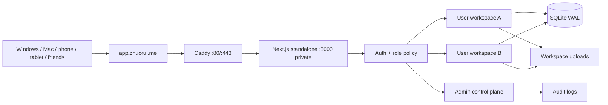

# ZGCA Workbench upgrade briefing

Date: 2026-07-10  
Branch: `codex/multi-user-modernization`  
Status: application upgrade complete and release-gated; public production launch waits for ICP filing and DNS cutover.

## Outcome

ZGCA is now a multi-user learning service rather than a single-user Mac mini dashboard:

- Every ordinary user owns one isolated workspace with independent tasks, notes, subjects, knowledge points, reviews, mistakes, settings, files and analytics.
- Admin is a separate control-plane identity with no learning workspace. It can invite users, suspend/reactivate accounts, revoke sessions, reset passwords, set storage quotas, inspect audit logs and review a clearly marked user workspace summary.
- Invitation links are single-use and expire after 24 hours. Only SHA-256 token hashes are stored.
- Passwords use scrypt; sessions store token hashes; login failures are throttled; first Admin login and Admin password resets force a password change.
- Files are stored below a workspace-specific namespace, limited to 20MB each and 2GB per workspace by default. Downloads, search and mutations are workspace-scoped.
- Users can inspect and revoke their own active device sessions.

## Product and design upgrade

- Action-first home: the primary next step, due work, task completion, focus time and learning streak are above the fold.
- Focused day workspace: tasks are the primary column; reviews, quick logging, files and activity form contextual support.
- Modern application shell: collapsible desktop navigation, contextual top bar, on-demand capture drawer and mobile bottom navigation.
- `Ctrl/Cmd + K` command palette with keyboard navigation.
- Light, dark and system themes using semantic design tokens and a network-independent font stack.
- Accessible feedback: visible focus, reduced-motion support, toast messages, skeleton loading, route error recovery and custom destructive-action confirmation dialogs.
- Separate Admin navigation and a persistent “management view” identity banner when inspecting another user's workspace.

## Final visual evidence

| View | Screenshot |
| --- | --- |
| Login | [Desktop login](screenshots/final-login-desktop.png) |
| Main workspace | [Desktop home](screenshots/final-home-desktop.png) |
| Theme | [Dark home](screenshots/final-home-dark.png) |
| Mobile | [Mobile day workspace](screenshots/final-day-mobile.png) |
| Admin | [Admin overview](screenshots/final-admin-desktop.png) |
| Admin target context | [User workspace review](screenshots/final-admin-workspace.png) |

## Architecture

Production uses one app process because the current SQLite architecture and 4GB server are best matched to a single writer. Caddy is the only public HTTP service; port 3000 is not published. Next.js recommends a reverse proxy in front of a self-hosted server, and Caddy automatically obtains/renews certificates and redirects HTTP to HTTPS when a qualifying public hostname points at the server: [Next.js self-hosting](https://nextjs.org/docs/app/guides/self-hosting), [Caddy Automatic HTTPS](https://caddyserver.com/docs/automatic-https).

## Verification evidence

- Vitest: **87 tests passed** across 16 test files.
- ESLint: passed with zero findings.
- Next.js production build: passed; standalone output and 21 application routes generated.
- Standalone runtime: started directly from `.next/standalone`; `/api/health` returned `{"status":"ok"}`.
- Full ordinary-user Playwright smoke: passed login, settings, home, tasks, notes, autosave, study/mistake logging, knowledge CRUD, files, search, custom confirmation, analytics, calendar, capture and logout.
- Responsive audit: passed at 1440px, 1024px and 390px for auth, home, day, subjects and files; no horizontal overflow; command keyboard navigation, theme switching, mobile More sheet and capture drawer passed.
- Multi-user audit: **9 checks passed**, including independent task/file creation, cross-user file requests returning 404, Admin summaries, suspension invalidating an existing session and audit entries.
- Migration verifier on the final isolated release database: 2 ordinary workspaces + 1 Admin, zero invalid workspace rows, zero invalid file namespaces, zero missing files and zero cross-workspace relationship violations.

## Deployment decision for `zhuorui.me`

Recommended public hostname: `app.zhuorui.me`.

1. Keep `ssh.zhuorui.me -> 82.157.141.186` DNS-only for SSH.
2. The existing `zgca.zhuorui.me` Cloudflare Tunnel record belongs to the former Mac mini deployment and is not part of the new architecture. Remove it only after the new hostname is fully verified.
3. After ICP approval, add `A app -> 82.157.141.186`. Start DNS-only to verify direct origin HTTPS, then optionally compare Cloudflare Proxied mode with Full (strict) TLS. Cloudflare documents that DNS-only exposes the origin IP while Proxied routes web traffic through Cloudflare: [Cloudflare proxy status](https://developers.cloudflare.com/dns/proxy-status/).
4. Tencent documents that a website hosted on a mainland Tencent Cloud server must complete the applicable filing before service is opened. The current filing workflow is documented here: [Tencent Cloud first ICP filing](https://cloud.tencent.com/document/product/243/97668).
5. Follow [`deploy/README.md`](../deploy/README.md) for firewall, SSH keys, environment setup, first launch, health checks, backup, upgrade and rollback.

## Operational boundaries

- Public deployment was intentionally not performed while ICP filing is in progress.
- The local machine does not have Docker CLI installed, so the Compose image was not built locally. The exact Next.js standalone payload used by the Dockerfile was built and run successfully; the image build remains a server-side prelaunch check.
- Admin learning-space review is read-only by design. Admin manages identities, access, security and quotas without silently editing a user's learning record.
- Invitations are copied manually; there is no SMTP dependency.
- SQLite is appropriate for this personal/friends deployment, but not for horizontal multi-instance scaling.
- The 3Mbps uplink is the practical bottleneck. Large video hosting should stay out of this service.
- Backups must be copied off the server; snapshots on the same 40GB disk are not disaster recovery.

## Acceptance checklist after ICP approval

- [ ] Add the `app.zhuorui.me` A record and open only 80/443 publicly.
- [ ] Install Docker Engine + Compose plugin on Ubuntu 24.04.
- [ ] Deploy with `compose.production.yml`; confirm app and Caddy are healthy.
- [ ] Log in as ordinary owner and verify the legacy workspace/data counts.
- [ ] Log in as Admin, change the bootstrap password, then remove bootstrap password variables.
- [ ] Run `npm run verify:migration`, smoke, responsive audit and multi-user audit against the real hostname.
- [ ] Configure daily backup and an off-server copy.
- [ ] Remove the old Mac mini Tunnel record only after the new service has been stable.

