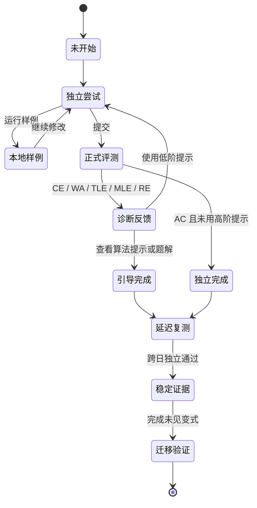
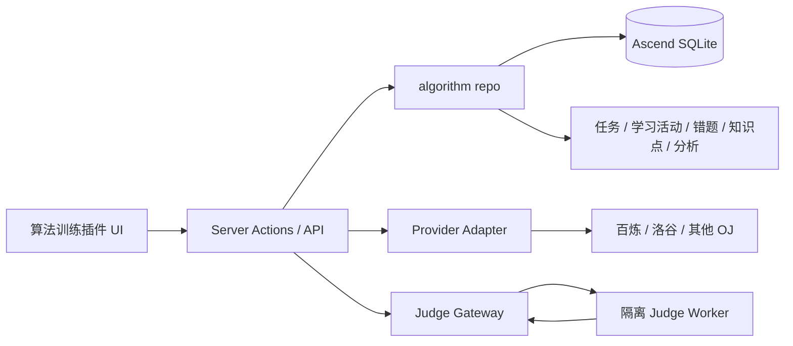

# Ascend 插件平台与算法训练插件设计

日期：2026-07-26  
状态：Phase 1、Phase 2 本地实现与试点治理已完成；独立 Judge 运行验收、真实终端和生产试点仍待外部证据

## 0. 结论先行

Ascend 不应直接新增一个写死在导航中的“算法题”页面。正确的第一步是同时设计：

1. **扩展平台**：负责插件发现、启用、排序、权限、配置、导航、搜索、任务、分析、导出和 Agent 接入；
2. **算法训练插件**：作为第一个受信任插件，验证扩展平台能否支撑完整学习闭环；
3. **评测提供方适配层**：把百炼、洛谷开放平台、自建 Judge0 或未来其他 OJ 当作可替换 provider，而不是把某个平台写死进算法插件。

首版只允许 Ascend 仓库内经过审查、随应用一起构建的 **trusted built-in plugins**。不允许用户上传 JavaScript、npm 包或服务端脚本。用户可以选择启用、停用、排序和授权插件，但不能让第三方代码进入主应用进程。

算法插件的目标不是复制一个 OJ 首页，而是补全 Ascend 当前最缺的客观学习证据：

> 选题 → 独立尝试 → 编译/样例 → 正式评测 → 分层反馈 → 错误归因 → 延迟复测 → 变式迁移 → 回写今日计划与学习分析

## 1. 证据口径与当前事实

- `[COMPUTED]`：由当前仓库代码直接确认；
- `[KNOWN]`：较稳定的学习科学、在线评测或安全工程共识；
- `[INFERRED]`：由现状推导出的产品或架构建议，仍需实现和用户验证；
- `[UNKNOWN]`：目前没有足够资料，不能当作已经具备的能力。

### 1.1 当前 Ascend 的可复用基础

- `[COMPUTED]` `ModulesSection` 已支持五个固定板块的启停和排序。
- `[COMPUTED]` `Sidebar`、移动端“更多”和 `CommandPalette` 都会读取 `modulePrefs`。
- `[COMPUTED]` `modulePrefs` 是 `src/lib/repo/settings.ts` 中的固定 TypeScript 枚举，未知 key 会被剔除。
- `[COMPUTED]` 当前功能板块机制只解决导航显隐，不提供插件清单、权限、配置、数据生命周期、搜索、导出、Agent 操作或版本兼容。
- `[COMPUTED]` Ascend 已有任务、学习活动、知识点、错题、复测、分析、工作区隔离和审计能力；算法训练不应平行复制这些公共能力。
- `[COMPUTED]` 主服务是 Next.js + better-sqlite3，生产为单个应用容器。它不具备安全执行任意用户代码的隔离边界。

因此，现有 `modulePrefs` 是插件体验的原型，但不是插件架构。

### 1.2 外部平台边界

- `[UNKNOWN]` 当前未确认“百炼 / OpenJudge”是否向第三方提供稳定、公开、获授权的题库、提交、结果回调和账号绑定 API。
- `[KNOWN]` 题面、测试数据、题解和用户提交记录可能分别受著作权、平台条款和隐私规则约束。
- `[INFERRED]` 未获得官方 API 与许可前，只能把百炼作为“外部链接 + 用户主动记录/导入结果”的 provider，不能使用网页抓取、共享机器人账号或模拟登录。
- `[KNOWN]` Judge0 提供异步提交、沙箱执行和 HTTP API，但它只解决代码执行，不自动提供有权使用的题库、测试数据或教学设计。

## 2. 产品定位

### 2.1 扩展平台

用户侧名称建议使用 **“扩展”**，开发侧继续使用 `plugin`：

- “功能板块”：Ascend 自带核心能力，如知识体系、错题、资料库；
- “扩展”：可按需启用、拥有独立数据和权限的能力，如算法训练、英语听写、论文阅读、实验记录；
- “连接”：扩展使用的外部服务，如百炼、洛谷开放平台、Judge0。

三者不要混为一个概念。一个算法训练扩展可以连接多个 OJ provider，也可以完全使用 Ascend 自有题目。

### 2.2 算法训练插件

目标用户分三类：

1. **基础学习者**：需要学会识别基本算法、实现和调试；
2. **考试准备者**：围绕考试范围、截止日期和薄弱点训练；
3. **竞赛训练者**：需要限时、混合题组、复杂度与迁移能力。

首版优先前两类，不以排行榜、竞赛社区或海量题库为核心。

### 2.3 明确不做

- 不在主应用容器内 `exec`、`spawn` 或 `eval` 用户代码；
- 不允许上传任意第三方服务端插件；
- 不抓取百炼或其他 OJ 的题面、测试数据、Cookie 和提交结果；
- 不以连续打卡、刷题数量或 AC 总数冒充学习效果；
- 不在用户尚未充分尝试时自动给出完整答案；
- 不把一次 AC 直接标记为“已掌握”；
- 首版不做社交、排行榜、比赛直播、反作弊考试监考。

## 3. 用户体验与信息架构

### 3.1 扩展中心

新增 `/extensions`：

- 已安装：启用、停用、排序、查看权限和数据占用；
- 可用扩展：算法训练及未来官方扩展；
- 连接状态：未连接、已连接、需重新授权、服务异常；
- 数据操作：导出、断开连接、删除扩展数据；
- 版本状态：正常、需迁移、不兼容、管理员禁用。

设置页现有“功能板块”保留，另加“扩展”。两者可以共享排序体验，但暂不强行合并数据模型。

### 3.2 算法训练主路由

建议路由：

```text
/practice/algorithms
├── 今日训练          推荐题组、到期复测、继续上次会话
├── 题库              来源、主题、难度、状态、语言筛选
├── 训练计划          考试范围、每周容量、专题与混合训练
├── 历史与复盘        会话、提交、错误归因、题解笔记
├── 学习分析          延迟独立解决率、迁移率、信心校准
└── 连接与设置        provider、语言、编辑器、代码保留策略
```

主入口只显示一个“算法训练”，不要把不同 OJ 分别放进全局侧栏。

### 3.3 今日训练页

默认只给一个清晰下一步：

- “继续上一题”；
- “完成今天的 3 题训练”；
- “进行 7 天延迟复测”；
- “先做 10 分钟诊断”；
- 没有配置时进入连接/目标设置。

今日题组建议由四部分组成，比例只是首版启发式，不应宣传为已验证最优：

| 来源 | 初始比例 | 目的 |
|---|---:|---|
| 到期复测 | 40% | 保持与检验长期独立解决 |
| 当前专题 | 30% | 建立当前算法模式 |
| 变式迁移 | 20% | 防止只记住原题 |
| 探索题 | 10% | 扩展题型覆盖 |

当用户每日只安排 1–2 题时，优先级依次为到期复测、当前专题、变式迁移，不机械凑比例。

### 3.4 单题训练会话

桌面/平板采用三栏或两栏可切换：

```text
题目与约束 | 思路/代码编辑器 | 运行、提交、反馈与复盘
```

手机端不压缩成不可用的三栏：

- 默认分步页签：题目 → 思路 → 代码 → 结果；
- 支持查看、短代码修改、复盘和复测；
- 长时间编码建议桌面完成，但不能直接禁止移动端。

训练状态机：



## 4. 学习科学设计

### 4.1 学习证据单位

系统不只记录 submission，还要记录一次完整 `attempt`：

- 是否先写出思路、伪代码或关键不变量；
- 首次尝试开始、首次运行、首次提交和 AC 时间；
- 编译、运行和评测结果序列；
- 使用了哪一级提示；
- 揭晓前信心；
- 错误类型和纠正规则；
- 时间、空间复杂度解释；
- 延迟后能否独立重做；
- 能否解决同知识点的未见变式。

一次 AC 只能证明该提交通过当前测试，不足以证明长期保持或迁移。

### 4.2 能力模型

算法能力至少拆成五类证据，不合并成一个虚假的 0–100 “算法掌握度”：

1. **识别**：能判断题目属于什么约束、模式或算法族；
2. **设计**：能给出关键思路、不变量和边界条件；
3. **实现**：能将思路写成正确代码；
4. **调试**：能根据 CE/WA/TLE/RE 定位和修正；
5. **迁移**：能在未见变式中重新选择并使用方法。

每个知识标签显示：

- 证据状态：样本不足 / 引导完成 / 独立完成 / 延迟稳定 / 迁移验证；
- 样本数；
- 最近一次独立结果；
- 最近一次提示级别；
- 到期复测日期。

### 4.3 分层反馈

失败后按最小充分帮助原则逐层开放：

1. **L0 评测事实**：状态、编译器信息、耗时、内存、公开样例差异；
2. **L1 定位提示**：指出可能的边界、复杂度或错误类别，不给算法名；
3. **L2 概念提示**：指出应复查的模式、数据结构或不变量；
4. **L3 解题骨架**：给出步骤或伪代码，不给完整可提交代码；
5. **L4 题解/参考实现**：用户明确请求后展示，并把本题标记为“引导完成”。

规则：

- 提示暴露必须进入证据记录；
- L3/L4 后的 AC 不能算独立完成；
- 编译器报错和公开样例输出不应被当成“作弊提示”；
- AI 可以解释错误，但不能用自然语言结果替代确定性评测；
- AI 生成的反馈要标记来源，且不能看到隐藏测试数据或参考答案密钥。

### 4.4 间隔与迁移

首版采用可解释启发式，后续依据真实数据校准：

| 当前结果 | 首次复测建议 | 后续复测 |
|---|---:|---:|
| AC，未用 L2–L4 | D+3 | D+10、D+30 |
| AC，使用 L1–L2 | D+1 | D+4、D+14 |
| 看过骨架/题解后完成 | D+1 做原题 | D+4 做同构变式、D+14 未见变式 |
| 未完成/放弃 | 同日看 worked example | D+1 做更易同类题，再回原题 |

这些日期是产品初值，不是算法学习的普适定律。

复测分三类，分析时不能混在一起：

- 原题重做：检验实现保持，但可能含记忆；
- 同构变式：检验方法迁移；
- 未见综合题：检验选择与组合。

### 4.5 选题难度

冷启动不伪造预测成功率：

- 先做 6–10 题短诊断，覆盖基础实现、复杂度、常见数据结构和边界处理；
- 样本不足时只用用户选择的水平、题目难度和历史结果；
- 有足够样本后，才估算“独立解决概率”，并显示为区间而非精确百分比；
- 连续两题无进展时降低支架或难度，避免无效坚持；
- 连续轻松首提 AC 时引入变式、混合或更高约束，不只增加数量。

### 4.6 学习指标

核心结果指标：

- **首个独立 AC 率**：未使用 L2–L4 的首次会话中独立通过比例；
- **7/30 天延迟独立解决率**：到期复测中不依赖高阶提示的通过比例；
- **未见变式迁移率**：从未做过的同知识点变式中独立通过比例；
- **错误复发率**：同一错误类别在后续同类题中的再次出现率；
- **信心校准误差**：提交前信心与结果之间的偏差；
- **中位有效尝试时长**：排除页面闲置后，从开始到独立解决或主动结束的时长。

过程指标：

- 题量、提交次数、提示使用、计划完成率和专注时长；
- 过程指标用于解释结果，不能单独宣称掌握提升。

保护指标：

- 连续两次会话无进展的比例；
- L4 题解过早暴露率；
- 到期队列 P50/P90 积压龄；
- judge P50/P95 延迟、失败率和队列长度；
- 外部连接失败、授权过期和结果同步冲突。

少于 5 个有效样本只展示事实，不生成“明显提升/退步”结论。单用户前后变化只能视为趋势，不能宣称因果。

## 5. 插件平台架构

### 5.1 信任模型

插件分三档，但首版只实现第一档：

| 类型 | 执行位置 | 首版 | 边界 |
|---|---|---|---|
| 内置受信任插件 | Ascend 构建产物内 | 是 | 代码审查、测试、随主应用发布 |
| 外部连接器 | 服务端 provider adapter | 部分 | 只通过受控 HTTP API，不执行远端代码 |
| 第三方运行时插件 | iframe/独立服务/签名包 | 否 | 需要独立权限、版本、签名和沙箱体系 |

绝不把“用户能启用插件”解释成“用户能把任意代码装进 Next.js 进程”。

### 5.2 静态插件清单

清单由代码注册，数据库只保存安装状态和配置：

```ts
type PluginManifest = {
  id: string;
  version: string;
  apiVersion: 1;
  name: string;
  description: string;
  routes: Array<{ href: string; label: string; group: string }>;
  permissions: PluginPermission[];
  slots: {
    navigation?: boolean;
    commandPalette?: boolean;
    todayRecommendations?: boolean;
    workspaceSearch?: boolean;
    analytics?: boolean;
    dataExport?: boolean;
    agentOperations?: boolean;
  };
  configVersion: number;
};
```

清单中的 React 组件、repo 方法和 Agent handler 必须从受控 registry 绑定，不能从数据库字符串动态加载模块。

### 5.3 扩展槽位

核心系统只提供稳定槽位：

- `navigation`：侧栏、移动端更多、路由标题；
- `commandPalette`：页面、命令和插件实体搜索；
- `todayRecommendations`：将插件建议转成今日动作；
- `workspaceSearch`：统一搜索结果；
- `analytics`：带指标定义与样本量的卡片；
- `dataExport`：结构化导出和附件清单；
- `agentOperations`：受权限与审计约束的操作；
- `settings`：插件配置，不允许覆盖核心安全设置。

插件不能覆盖登录、管理员、工作区隔离、备份、审计、根布局或数据库连接。

### 5.4 权限

建议权限粒度：

```text
core.tasks.read
core.tasks.write
core.study-events.write
core.knowledge.read
core.knowledge.link
core.analytics.contribute
plugin.algorithms.data
provider.network
provider.credentials
judge.submit
```

安装时显示用户能理解的授权说明；危险权限单独确认。服务端仍以 `workspace_id` 强制隔离，前端隐藏不构成权限。

### 5.5 生命周期

```text
available → enabled → disabled
                  ↘ needs_reauth
                  ↘ incompatible
                  ↘ admin_disabled
```

- 停用：隐藏入口、暂停推荐与同步，保留数据；
- 断开连接：删除/吊销 provider 凭据，保留 Ascend 内学习记录；
- 卸载：默认保留可导出的插件数据；
- 删除数据：单独的破坏性操作，明确数量和不可逆范围；
- 升级：manifest API、配置版本和数据迁移分别检查；
- 降级：不自动回滚插件数据结构。

## 6. 算法插件技术架构

### 6.1 组件关系



provider 与 judge 是两个概念：

- provider 提供题目身份、题面链接、提交和结果；
- judge 执行代码并返回确定性结果；
- 有些 provider 同时提供两者，有些只提供题目或外链。

### 6.2 Provider 协议

```ts
type AlgorithmProviderCapabilities = {
  browseProblems: boolean;
  readProblem: boolean;
  submit: boolean;
  pollSubmission: boolean;
  importHistory: boolean;
  webhooks: boolean;
};

interface AlgorithmProvider {
  getCapabilities(): AlgorithmProviderCapabilities;
  searchProblems(input: ProviderSearch): Promise<ProviderProblemPage>;
  getProblem(ref: ProviderProblemRef): Promise<ProviderProblem>;
  submit?(input: ProviderSubmission): Promise<ProviderSubmissionRef>;
  getSubmission?(ref: ProviderSubmissionRef): Promise<ProviderSubmissionResult>;
  importHistory?(cursor?: string): Promise<ProviderHistoryPage>;
}
```

每个 adapter 必须声明：

- 认证方式和 token 生命周期；
- 速率限制、超时和重试；
- 题面与测试数据是否允许缓存；
- 支持语言与 verdict 映射；
- 是否能可靠关联当前用户；
- 数据删除和断开连接行为。

### 6.3 建议数据模型

公共安装表：

```text
workspace_plugins
- workspace_id
- plugin_id
- enabled
- nav_order
- config_json
- config_version
- installed_version
- state
- created_at / updated_at
UNIQUE(workspace_id, plugin_id)
```

算法域：

```text
algorithm_provider_connections
- id, workspace_id, provider_id
- status, account_label
- encrypted_credentials
- credentials_version
- last_sync_at, sync_cursor, last_error_code

algorithm_problems
- id, workspace_id
- provider_id, external_problem_id, source_url
- title, difficulty_band, time_limit_ms, memory_limit_kb
- statement_storage_mode
- license_metadata_json
- metadata_json, updated_at
UNIQUE(workspace_id, provider_id, external_problem_id)

algorithm_problem_skills
- workspace_id, problem_id
- skill_key, role, confidence

algorithm_attempts
- id, workspace_id, problem_id
- session_day, language
- started_at, ended_at
- pre_confidence, plan_text
- max_hint_level
- outcome
- active_seconds
- independent
- source_task_id
- transfer_source_problem_id（同构/未见变式必须指向同 workspace 的已独立 AC 来源题）

algorithm_submissions
- id, workspace_id, attempt_id
- provider_submission_id
- code_blob_id
- language, verdict
- time_ms, memory_kb
- submitted_at, judged_at
- compiler_excerpt, public_feedback_json

algorithm_reflections
- workspace_id, attempt_id
- error_category
- correction_rule
- complexity_time, complexity_space
- takeaway

algorithm_reviews
- id, workspace_id, problem_id
- source_attempt_id
- review_kind
- due_day, completed_at
- attempt_id
```

要求：

- 所有业务查询携带 `workspace_id`；
- code 不直接塞进通用日志、审计正文或错误聚合；
- 大代码或多文件提交使用 blob 存储，SQLite 只保留引用；
- 数据导出必须包含来源、提交、反馈、复盘和连接元数据，但不导出 provider secret；
- 删除问题前解除与任务、学习活动、错题和复测的引用。

### 6.4 与 Ascend 核心闭环

- 算法训练计划可以生成 `day_tasks`，`source_type="plugin:algorithms"`；
- 完成一次有效会话后写入 `study_sessions`，记录真实 active minutes，而不是页面打开时间；
- 同一题多次 WA 不自动生成多条错题；
- 会话结束时按错误类别聚合为一个“算法错误案例”，用户确认后进入错题回炉；
- 题目技能可以关联 Ascend 知识点，但 provider tag 不直接污染主知识树；
- 延迟复测使用现有任务—来源—复测证据链；
- 算法指标通过 analytics slot 汇入分析页，原始 submission 仍归算法插件管理；
- Agent 操作使用 `algorithm.*` 命名并复用统一 operations 层、确认和审计规则。

## 7. 在线评测与安全

### 7.1 首选顺序

1. 有正式合同/API 的托管评测服务；
2. 独立主机或独立安全边界中的 Judge0/DOMjudge worker；
3. 本地浏览器仅运行公开样例，作为编辑辅助，不作为最终评测；
4. 不接受在 Ascend 主容器内直接执行代码。

### 7.2 Judge Gateway

Ascend 只和 gateway 通信：

- 创建异步 submission，立即返回内部 ID；
- 轮询或 webhook 更新状态；
- 幂等键避免重复提交；
- 限制代码体积、语言、并发和每日额度；
- 隐藏测试数据永不返回给浏览器或 AI；
- 标准化 `QUEUED/RUNNING/AC/WA/TLE/MLE/RE/CE/JE/CANCELLED`；
- 熔断 provider/judge 故障，不能拖垮主应用请求线程。

### 7.3 Worker 最低安全边界

- 独立 worker，不挂载 Ascend 数据库、uploads、备份、环境变量或 Docker socket；
- 默认无外网；
- 临时只写文件系统，执行后销毁；
- 非 root、只读根文件系统、最小 capability；
- CPU、内存、进程数、文件数、输出、磁盘和墙钟时间上限；
- cgroup + syscall/seccomp 等隔离；仅 Docker 容器不是完整威胁模型；
- 编译镜像固定版本、定期补丁、依赖清单和漏洞扫描；
- judge token 与 Ascend 用户身份分离；
- 审计只记 submission ID、状态、资源量和错误代码，不记完整源码。

当前生产单机同时承载主应用和恶意代码执行风险过高。若自建 worker，至少使用独立虚拟机；更高风险场景考虑 microVM 级隔离。

## 8. 百炼接入策略

由于公开 API 和授权边界尚未确认，分三档设计：

### A. 外链记录模式，可立即实现

- 用户保存百炼题目 URL、编号、标题、主题和目标日期；
- 点击跳转到官方平台做题；
- 回到 Ascend 记录 verdict、用时、提示和复盘；
- 可上传官方导出的记录文件，但必须由用户主动提供；
- 这类结果标记为 `user_reported`，不冒充 API 验证。

### B. 官方只读同步

只有官方提供 OAuth/API/导出并允许使用时开启：

- 导入题目元数据和当前用户提交历史；
- 保存外部 submission ID 与同步时间；
- 以 provider 返回的签名/响应为 `provider_verified`；
- 不缓存不允许复制的题面和题解。

### C. 官方提交与回调

只有提交 API、账号授权、限流、版权与隐私条款全部明确时开启：

- Ascend 内提交；
- provider 异步评测；
- webhook 或轮询结果；
- provider 故障时允许保存草稿，不伪造结果。

若百炼不能提供正式能力，应长期停留在 A，而不是通过抓取实现 B/C。

## 9. 分期路线

### Phase 0：验证与边界

- 确认目标人群、首批语言、首批知识体系和每日容量；
- 向百炼/OpenJudge 确认 API、授权、题面与测试数据规则；
- 选择托管 judge 或独立 worker；
- 决定代码默认保留策略与加密/删除要求；
- 制作 30–50 道自有或明确授权的试点题。

退出条件：题源、评测、安全与隐私四项都有明确负责人和书面边界。

### Phase 1：扩展框架最小闭环

- 静态 plugin registry；
- `workspace_plugins`；
- 扩展中心与启停/排序；
- 导航、命令面板、设置和路由标题槽位；
- workspace 权限、数据导出和审计契约；
- 一个“示例插件”做契约测试。

退出条件：插件停用后入口、推荐、搜索和 Agent 操作全部消失，数据保留且可导出；重新启用后恢复。

### Phase 2：算法训练 MVP

- 自有/授权题库；
- 题目、思路、编辑器、样例运行和异步正式评测；
- attempt/submission/reflection/review 数据链；
- CE/WA/TLE/RE 与分层提示；
- 今日任务、学习活动、错题和延迟复测集成；
- 桌面、平板、手机分步体验；
- 核心结果指标和 judge 健康指标。

退出条件：用户能从今日任务开始，独立提交，失败后得到有限反馈，完成复盘，并在跨日复测后形成可解释证据。

### Phase 3：Provider 接入

- 先实现百炼外链记录；
- 有官方条件时再做只读同步；
- 洛谷开放平台或其他正式 API 作为第二 provider，验证适配器不依赖单一平台；
- 同一题跨 provider 去重只做显式映射，不用标题模糊匹配自动合并。

### Phase 4：自适应与实验

- 依据真实样本校准难度和复测间隔；
- 评估分层提示对独立完成、延迟保持和放弃率的影响；
- 引入题型混合与变式推荐；
- 多用户样本足够时才做随机实验；单用户只做趋势和人工复盘。

## 10. 验收标准

### 10.1 扩展框架

- 未启用插件不能访问其页面、操作、API 或 Agent 工具；
- 直接输入路由仍由服务端检查 enabled 与 workspace；
- 插件排序在侧栏、移动端更多和命令面板一致；
- 停用不删除数据；删除数据是独立确认操作；
- provider secret 不进入客户端、日志、导出、备份校验正文或 MCP；
- 插件 schema 迁移只追加，旧版本 checksum 不被修改；
- 一个插件故障不阻断首页、今日页和登录；
- 导出和备份包含插件业务数据及 blob 引用。

### 10.2 算法训练

- submission 创建幂等，重复点击不产生重复评测；
- judge 超时、队列满和 provider 失败都有可恢复状态；
- AC、WA、CE、TLE、MLE、RE、JE 映射有契约测试；
- L3/L4 提示后通过不计入独立 AC；
- 原题、同构变式、未见综合题分别统计；
- 页面闲置时间不计入 active minutes；
- 同一会话多次失败不会污染错题数量；
- 任务、活动、错误案例、复测和算法 attempt 可以双向追溯；
- 样本不足不生成强结论；
- 390px、768px、桌面三类视口完成关键流程；
- 未授权题面、隐藏测试和完整题解不会进入 AI 上下文。

### 10.3 安全

- judge worker 无 Ascend 数据卷、密钥和公网出站；
- 资源耗尽、fork bomb、超量输出、死循环和非法 syscall 有隔离测试；
- worker 被攻破时，不能访问主应用数据库、备份、其他用户代码或 provider secret；
- 连接撤销后无法继续同步或提交；
- 代码删除与工作区删除能清理对应 blob；
- 生产发布前完成独立环境渗透/逃逸测试和容量压测。

## 11. 决策清单

实施前需要产品负责人确认：

1. 首批服务对象是基础算法学习、考试准备还是算法竞赛；
2. 首批语言：建议 C++ + Python，还是只做一种；
3. 是否接受首版使用自有/授权题库，百炼先以外链模式接入；
4. 托管 judge 与独立 worker 的预算和风险偏好；
5. 用户源码默认永久保留、限期保留，还是只保留最后一次 AC；
6. 是否允许 AI 提示，以及最高默认开放到 L2 还是 L3；
7. 算法知识标签是否映射到已有科目知识树，还是保持插件局部 taxonomy；
8. 扩展是“每个个人 workspace 自选”，还是管理员可统一禁用部分扩展。

## 12. 研究与工程依据

- Roediger & Butler：提取练习有助于长期保持，反馈通常能增强效果；但不能把这一结论直接等同于任意复杂算法题训练。
  - https://pubmed.ncbi.nlm.nih.gov/20951630/
- Pan & Rickard：测试增强学习的迁移平均有效，但受测试形式、初始表现和练习方式影响，因此设计中单列“未见变式迁移率”。
  - https://pubmed.ncbi.nlm.nih.gov/29733621/
- Leinonen、Hellas 与 Edwards：编程初学实验显示，在正确性反馈之外展示程序输出有利于学习；因此样例运行是正式提交前的独立步骤。
  - https://aaltodoc.aalto.fi/items/98f20d4c-24e4-4071-bb42-4cc55cc54b34
- 自动编程评测综述指出，许多系统主要反馈通过/失败或输出差异，对可维护性和更深层能力覆盖有限；因此本设计把确定性评测与教学反馈分开。
  - https://arxiv.org/abs/2306.11722
- Judge0 官方 API 说明其异步提交、运行约束、沙箱和 web/worker 分离能力。
  - https://ce.judge0.com/docs
- DOMjudge 官方文档说明 judgehost 使用 chroot 与 cgroups 隔离提交。
  - https://www.domjudge.org/docs/manual/8.0/install-judgehost.html
